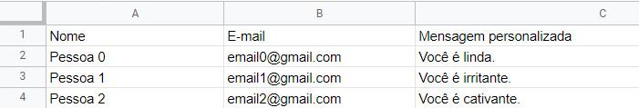
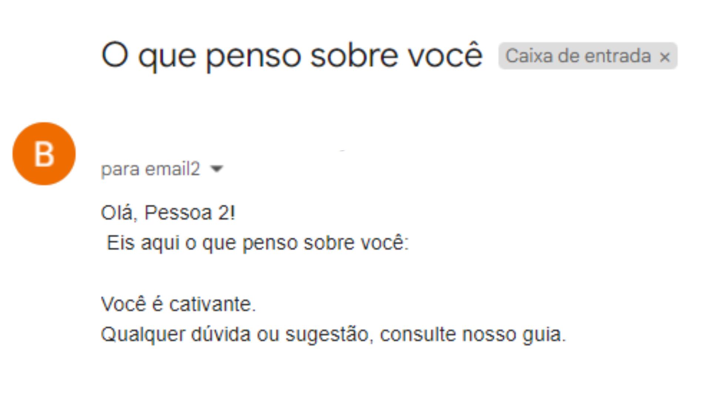

# Envio de E-mails com Python

## 🎯 Objetivo do Projeto
Automatizar o **envio de e-mails personalizados**, extraindo os dados requeridos de uma planilha. O exemplo utilizado extraiu nome, e-mail e uma mensagem personalizada de cada pessoa.

## 📌 Orientações básicas

* Para conseguir utilizar esse projeto, é preciso criar uma senha de app no Google após ativar a verificação de dois fatores. Para isso, o seguinte procedimento deve ser feito:
  
  * Ligar a verificação de 2 etapas;
  * Criar uma senha de app. Na seleção de apps, escolha outros. Vai aparecer um código em amarelo, copie e salve. Vamos nos referir a esse código como **senha** daqui pra frente.
* O envio é realizado através do Gmail. Para enviar de outros provedores, deve-se ir na linha abaixo do código:
  ```
   with smtplib.SMTP_SSL('smtp.gmail.com', 465, context = safe) as smtp:
    smtp.login(email_origem, email_senha)
    smtp.sendmail(email_origem, email_destino, mensagem.as_string())
  ```
  Substitua os parâmetros smtp.gmail.com e a porta 465 pelos relativos ao provedor que você deseja. Você pode consultar alguns [aqui](https://ajuda.bellesoftware.com.br/knowledge-base/parametros-gerais-smtp/).
* Este código se baseia na extração de dados de arquivos csv para envios personalizados em massa. O arquivo de e-mail, no entanto, não sofreu estilização, que seria possível utilizando arquivos de HTML/CSS como corpo do texto e abrindo esses arquivos para leitura, dentre outros procedimentos.


## ✨ Exemplo de Uso 
* As bibiotecas usadas, com exceção da [Pandas](https://www.acervolima.com.br/2021/01/como-instalar-o-python-pandas-no.html), já vêm instaladas por padrão nas versões mais recentes de Python. 

```
import pandas as pd
from email.message import EmailMessage
import smtplib
import ssl
import os
import mimetypes
```
* Na linha 10 do código, temos uma variável chamada email_senha. Lá que deve ser colocada a senha que criamos nas orientações básicas.
* Para fins de exemplo, vamos utiizar uma planilha chamada *pessoas.csv*, conforme abaixo:

* Nesse exemplo, o código completo ficaria:
```
email_senha = 'fkekrnnj3248ndks'

email_origem = 'seuemail@gmail.com'

planilha = pd.read_csv("pessoas.csv")

emails_de_envio = planilha['E-mail'].tolist()
lista_de_nomes = planilha['Nome'].tolist()
feedback = planilha['Mensagem personalizada'].tolist()

for i in range(0, 3):
  email_destino = emails_de_envio[i]
  nome = lista_de_nomes[i]
  assunto = 'O que penso sobre você' #Campo de assunto do email
  feedback_atual = feedback[i]

  corpo = f"Olá, {nome}!\n Eis aqui o que penso sobre você:\n\n" + feedback_atual + "\nQualquer dúvida ou sugestão, consulte nosso guia."


  mensagem = EmailMessage()
  mensagem["From"] = email_origem
  mensagem["To"] = email_destino
  mensagem["Subject"] = assunto

  mensagem.set_content(corpo)
  safe = ssl.create_default_context() 
  
  with smtplib.SMTP_SSL('smtp.gmail.com', 465, context = safe) as smtp:
    smtp.login(email_origem, email_senha)
    smtp.sendmail(email_origem, email_destino, mensagem.as_string())
```

* Os e-mails ficariam no seguinte formato:


